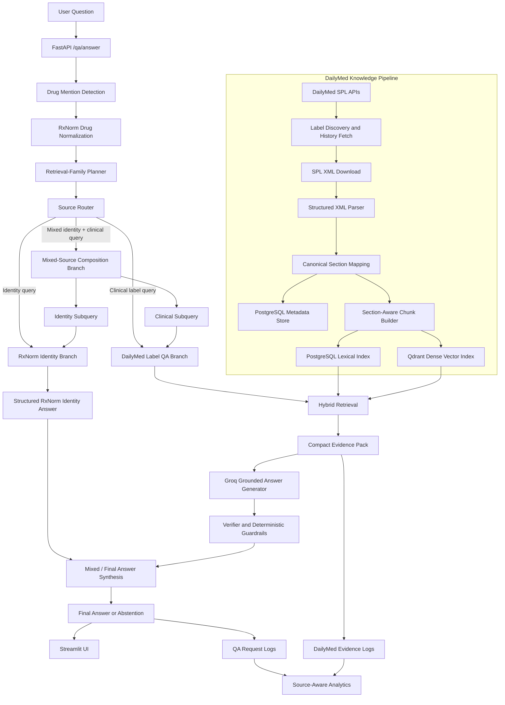

# MedLabelIQ

**MedLabelIQ** is a production-oriented, evidence-grounded medication question-answering system that combines:

- official **DailyMed SPL drug-label evidence**,
- **RxNorm medication identity reasoning**,
- **source-aware orchestration**,
- and **mixed-source query decomposition + grounded synthesis**.

The system answers medication questions only when its selected knowledge source directly supports the response. Otherwise, it returns a deterministic `insufficient_evidence` result.

MedLabelIQ was designed as a modern replacement for an earlier web-scraped medical QA prototype, addressing its core limitations:

- weak knowledge-source organization,
- unstructured document handling,
- shallow retrieval,
- unreliable chatbot responses,
- limited grounding,
- and lack of production observability.

---

## Full Technical Documentation

For a detailed project walkthrough, UI demonstrations, API examples, evaluation proof, and observability analysis, see:

[MedLabelIQ Comprehensive Documentation](docs/MEDLABELIQ_COMPREHENSIVE_DOCUMENTATION.md)

---

## Key Capabilities

### 1. Multi-Knowledge-Source QA

MedLabelIQ uses two distinct knowledge channels:

| Source | Purpose |
|---|---|
| **DailyMed SPL labels** | Clinical label-grounded QA: indications, warnings, interactions, adverse reactions, dosage, etc. |
| **RxNorm** | Medication identity reasoning: brand/generic equivalence, active ingredients, brand-name lookup, identity definitions. |

Examples:

```text
Is Eliquis the same as apixaban?
→ RxNorm identity route
```

```text
Can apixaban be taken with aspirin?
→ DailyMed clinical-label route
```

```text
Is Eliquis the same as apixaban and can it prevent stroke?
→ Mixed-source composed route
```

---

### 2. Source-Aware Orchestration

Before answering, the system performs:

1. drug mention detection,
2. optional RxNorm-based drug normalization,
3. retrieval-family planning,
4. source-route planning,
5. execution of one of three answer branches:

```text
RxNorm identity branch
DailyMed label branch
Mixed-source composition branch
```

The router can select:

```text
rxnorm_identity
dailymed_label
multi_source_composed
```

---

### 3. Mixed-Source Query Decomposition and Synthesis

For compound questions that combine identity and clinical intent, MedLabelIQ decomposes the original query into branch-specific subqueries.

Example:

```text
Original:
Is Eliquis the same as apixaban and can it prevent stroke?

Identity subquery:
Is Eliquis the same as apixaban?

Clinical subquery:
Can apixaban prevent stroke?
```

The system then:

- answers the identity branch using RxNorm,
- answers the clinical branch using DailyMed label evidence,
- synthesizes one grounded final answer,
- preserves both:
  - `R*` citations for RxNorm identity support,
  - `E*` citations for DailyMed label evidence.

Example composed answer:

```text
Yes. RxNorm maps Eliquis and apixaban to the same ingredient concept: apixaban.
Yes. Apixaban is indicated to reduce the risk of stroke and systemic embolism
in patients with nonvalvular atrial fibrillation.
```

---

### 4. Official Structured Medication Knowledge

The DailyMed pipeline ingests SPL XML labels rather than loosely scraped web pages.

It preserves:

- label metadata,
- SET IDs,
- label versions,
- product and ingredient records,
- section hierarchy,
- section codes,
- retrieval-family mappings,
- and evidence provenance.

---

### 5. Section-Aware Knowledge Engineering

MedLabelIQ parses nested label sections and maps them to canonical retrieval families such as:

- `warnings_and_precautions`
- `boxed_warning`
- `indications_and_usage`
- `adverse_reactions`
- `drug_interactions`
- `dosage_and_administration`
- `contraindications`
- `clinical_studies`
- `medication_guide`

This allows retrieval to respect the clinical structure of the label rather than treating labels as flat documents.

---

### 6. Hybrid Retrieval

The DailyMed QA branch uses:

- PostgreSQL lexical retrieval,
- Qdrant dense vector retrieval,
- hybrid Reciprocal Rank Fusion,
- drug-concept filtering,
- retrieval-family filtering,
- compact evidence-pack selection.

This improves relevance while reducing redundant prompt context.

---

### 7. Grounded Answer Generation

The DailyMed answer branch uses a Groq-hosted LLM with:

- strict grounded answer schema,
- explicit evidence citations,
- evidence summaries,
- verifier integration,
- deterministic safety-note insertion.

Clinical answers cite evidence IDs such as:

```text
E1, E2, E3
```

RxNorm identity answers cite:

```text
R1, R2
```

Mixed-source composed answers may cite both:

```text
R1, R2, E1
```

---

### 8. Abstention and Safety Controls

MedLabelIQ is intentionally conservative.

When evidence is not sufficient, it returns:

```json
{
  "status": "insufficient_evidence",
  "answer": "The retrieved drug-label evidence is not sufficient to answer this question reliably.",
  "citations": [],
  "evidence_summary": "No retrieved evidence directly established the requested claim."
}
```

The system includes:

- deterministic insufficient-evidence fallbacks,
- post-generation verifier support,
- guardrails for unsupported high-certainty claims,
- guardrails for unsupported negative treatment-use claims,
- conservative behavior when branch-specific support is incomplete.

---

### 9. Production-Oriented Application Layer

MedLabelIQ includes:

- FastAPI backend,
- Streamlit front end,
- PostgreSQL persistence,
- Qdrant vector store,
- Dockerized local stack,
- observability request logs,
- source-aware analytics exports,
- evaluation harnesses,
- pytest suite,
- GitHub Actions CI.

---

## Why This Project Matters

Medication QA is high-stakes. A system that retrieves topically related text but fabricates unsupported conclusions is not trustworthy.

MedLabelIQ is built around a stricter principle:

> **Only answer when the selected knowledge source directly supports the response. Otherwise, abstain.**

This project demonstrates practical engineering across:

- domain-grounded RAG,
- structured medical data ingestion,
- biomedical entity normalization,
- multi-source orchestration,
- query decomposition,
- hybrid search,
- LLM grounding,
- deterministic safety controls,
- API design,
- observability,
- evaluation,
- and containerized deployment.

---

## System Architecture



---

## End-to-End Workflow

### A. RxNorm Identity Workflow

Used for identity-style questions such as:

```text
Is Eliquis the same as apixaban?
What is the generic name of Glucophage?
What is the active ingredient in Eliquis?
Is Glucophage a brand name?
```

Flow:

```text
Query
→ Identity intent detection
→ RxNorm term resolution
→ Ingredient / brand concept traversal
→ Deterministic structured answer
→ R-citations
```

---

### B. DailyMed Label QA Workflow

Used for clinical label questions such as:

```text
What is omeprazole used for?
Can apixaban be taken with aspirin?
Can metformin cause lactic acidosis?
Does apixaban treat bacterial infections?
```

Flow:

```text
Query
→ Drug detection / normalization
→ Retrieval-family planning
→ Hybrid label retrieval
→ Compact evidence pack
→ Grounded answer generation
→ Verification + guardrails
→ E-citations or abstention
```

---

### C. Mixed-Source Composition Workflow

Used for compound questions such as:

```text
Is Glucophage the same as metformin and what is it used for?
Is Eliquis the same as apixaban and can it prevent stroke?
Is Glucophage a brand name and what is it used for?
```

Flow:

```text
Original query
→ Mixed-source route detection
→ Identity subquery decomposition
→ Clinical subquery decomposition
→ RxNorm identity execution
→ DailyMed clinical execution
→ Evidence-aware synthesis
→ R-citations + E-citations
```

---

## DailyMed Corpus and Chunking

The ingestion pipeline builds a reproducible smoke corpus of 12 representative medication concepts:

- acetaminophen
- ibuprofen
- metformin
- lisinopril
- atorvastatin
- amoxicillin
- sertraline
- albuterol
- omeprazole
- apixaban
- isotretinoin
- methotrexate

The pipeline:

1. discovers label metadata,
2. retrieves label version history,
3. downloads SPL XML packages,
4. stores manifests and checksums,
5. validates artifact consistency,
6. parses hierarchical SPL sections,
7. chunks retrievable clinical text,
8. indexes chunks for lexical and dense retrieval.

### Current Section-Aware Chunking Output

| Metric | Value |
|---|---:|
| Drugs in smoke corpus | 12 |
| Retrievable sections processed | 520 |
| Chunks created | 867 |
| Maximum words per chunk | 220 |
| Chunk overlap | 40 words |

---

## Retrieval Example

```powershell
uv run python -m medlabeliq.retrieval.search_cli `
  --query "acid-mediated GERD" `
  --drug omeprazole `
  --family indications_and_usage `
  --limit 5
```

---

## Evaluation Results

### 1. Lexical Retrieval Evaluation

#### Exact terminology smoke set

| Metric | Score |
|---|---:|
| Cases | 12 |
| Hit@1 | 1.000 |
| Hit@5 | 1.000 |
| MRR | 1.000 |

#### Paraphrase stress test

| Metric | Score |
|---|---:|
| Cases | 12 |
| Hit@1 | 0.333 |
| Hit@5 | 0.333 |
| MRR | 0.333 |

This gap motivated the addition of dense retrieval and hybrid Reciprocal Rank Fusion.

---

### 2. Grounded DailyMed QA Evaluation

#### QA smoke set

| Metric | Score |
|---|---:|
| Overall pass | 12/12 |
| Status accuracy | 12/12 |
| Answered-case pass | 8/8 |
| Abstention-case pass | 4/4 |
| Citation-policy pass | 12/12 |
| Cited-heading pass | 12/12 |
| Safety-note pass | 12/12 |

#### QA challenge set

| Metric | Score |
|---|---:|
| Overall pass | 16/16 |
| Status accuracy | 16/16 |
| Answered-case pass | 10/10 |
| Abstention-case pass | 6/6 |
| Citation-policy pass | 16/16 |
| Cited-heading pass | 16/16 |
| Safety-note pass | 16/16 |

The challenge set includes:

- paraphrased answerable questions,
- negative unsupported treatment claims,
- unsupported claims requiring abstention,
- guarantee-style overgeneralization traps,
- medically sensitive warning and contraindication questions.

---

### 3. Multi-Source Orchestration Evaluation

#### Multi-source smoke benchmark

| Metric | Score |
|---|---:|
| Cases | 11 |
| Overall pass | 11/11 |
| Status accuracy | 11/11 |
| Source-route accuracy | 11/11 |
| Source-route-status accuracy | 11/11 |
| Family-plan-status accuracy | 11/11 |
| Retrieval-family accuracy | 3/3 |
| Citation-policy pass | 11/11 |
| Citation-reference pass | 11/11 |
| Safety-note pass | 11/11 |

---

#### Multi-source challenge benchmark

| Metric | Score |
|---|---:|
| Cases | 19 |
| Overall pass | 19/19 |
| Status accuracy | 19/19 |
| Source-route accuracy | 19/19 |
| Source-route-status accuracy | 19/19 |
| Family-plan-status accuracy | 19/19 |
| Retrieval-family accuracy | 9/9 |
| Citation-policy pass | 19/19 |
| Citation-reference pass | 19/19 |
| Safety-note pass | 19/19 |

The challenge benchmark covers:

- supported RxNorm identity queries,
- unsupported identity queries requiring abstention,
- brand-name clinical questions,
- interaction and indication routing,
- ambiguous clinical queries,
- mixed-source identity + clinical questions,
- composed answers requiring both `R*` and `E*` citations.

---

## Grounding and Safety Design

### Deterministic Insufficient-Evidence Response

When support is insufficient, MedLabelIQ returns:

```json
{
  "status": "insufficient_evidence",
  "answer": "The retrieved drug-label evidence is not sufficient to answer this question reliably.",
  "citations": [],
  "evidence_summary": "No retrieved evidence directly established the requested claim."
}
```

---

### Guardrail 1: Guarantee-Style Claim Suppression

Example:

```text
Does metformin guarantee weight loss?
```

The system abstains unless retrieved label evidence explicitly supports guarantee-level certainty.

---

### Guardrail 2: Unsupported Negative Treatment Claim Suppression

Example:

```text
Does apixaban treat bacterial infections?
```

The system does not infer a negative claim merely because the retrieved label lists other uses. If the target claim is not explicitly established, it abstains.

---

### Mixed-Source Composition Safety

For a mixed query, both branches must produce sufficient support:

```text
Identity branch must be supported
+
Clinical label branch must be supported
```

Otherwise, the system returns `insufficient_evidence` rather than composing a partial answer.

---

## API

The FastAPI backend exposes:

| Method | Endpoint | Purpose |
|---|---|---|
| `GET` | `/` | Service overview |
| `GET` | `/health` | PostgreSQL, Qdrant, and LLM health |
| `GET` | `/drugs` | Indexed drug concept summaries |
| `GET` | `/families` | Retrieval-family summaries |
| `GET` | `/corpus/stats` | Corpus build and indexing statistics |
| `GET` | `/rxnorm/version` | RxNorm API version metadata |
| `POST` | `/normalize/drug` | Normalize a brand, generic, or noisy medication mention |
| `POST` | `/qa/answer` | Grounded medication QA |
| `POST` | `/retrieval/debug` | Retrieval-only evidence inspection |

---

### Example 1: DailyMed Clinical QA

```powershell
$body = @{
    query = "Can metformin cause dangerous acid buildup in the blood?"
    drug = "metformin"
    family = "warnings_and_precautions"
    include_evidence = $true
    include_diagnostics = $true
} | ConvertTo-Json

Invoke-RestMethod `
    -Method Post `
    -Uri "http://127.0.0.1:8011/qa/answer" `
    -ContentType "application/json" `
    -Body $body |
    ConvertTo-Json -Depth 40
```

---

### Example 2: RxNorm Identity QA

```powershell
$body = @{
    query = "Is Eliquis the same as apixaban?"
    include_evidence = $true
    include_diagnostics = $true
} | ConvertTo-Json

Invoke-RestMethod `
    -Method Post `
    -Uri "http://127.0.0.1:8011/qa/answer" `
    -ContentType "application/json" `
    -Body $body |
    ConvertTo-Json -Depth 80
```

Expected high-level behavior:

```text
planned_source = rxnorm_identity
result.status = answered
citations = R1, R2
```

---

### Example 3: Mixed-Source Composed QA

```powershell
$body = @{
    query = "Is Eliquis the same as apixaban and can it prevent stroke?"
    include_evidence = $true
    include_diagnostics = $true
} | ConvertTo-Json

Invoke-RestMethod `
    -Method Post `
    -Uri "http://127.0.0.1:8011/qa/answer" `
    -ContentType "application/json" `
    -Body $body |
    ConvertTo-Json -Depth 100
```

Expected high-level behavior:

```text
planned_source = multi_source_composed
result.status = answered
citations = R1, R2, E1
identity_evidence = present
evidence = present
mixed_source_composition.status = composed_answered
```

---

## Streamlit UI

The Streamlit front end includes:

- backend health panel,
- corpus snapshot,
- drug and retrieval-family filters,
- six example prompts,
- grounded answer display,
- status pills,
- source-route badges,
- citation chips,
- citation legend:
  - `E*` = DailyMed label evidence,
  - `R*` = RxNorm identity evidence,
- DailyMed evidence expanders,
- RxNorm identity evidence expanders,
- routing and source-plan expander,
- mixed-source decomposition panel,
- verifier and guardrail diagnostics,
- raw diagnostics JSON,
- retrieval-debug tab,
- recent query history.

Local UI:

```text
http://127.0.0.1:8501
```

---

## Observability

Every QA request can be logged to PostgreSQL using:

- `qa_request_log`
- `qa_evidence_log`

### Logged request fields include:

- query text,
- requested and resolved drug,
- drug-resolution status,
- detected drug mention,
- drug-mention detection status,
- requested and planned retrieval family,
- family-plan status and intent,
- planned source,
- source-plan status and intent,
- mixed-source composition status,
- final answer status,
- citations,
- evidence summary,
- safety note,
- proposed answer status,
- verifier verdict and rationale,
- guardrail state,
- DailyMed evidence count,
- RxNorm identity evidence count,
- API latency,
- timestamp.

---

### Analytics Generation

```powershell
uv run python -m medlabeliq.observability.generate_qa_analytics
```

Outputs:

```text
data/interim/qa_analytics/
outputs/qa_analytics/
```

### Generated analytics include:

- final answer status counts,
- latency summary statistics,
- intervention counts,
- verifier verdict distribution,
- requests by planned source,
- source-plan status distribution,
- family-plan status distribution,
- mixed-source composition status distribution,
- final answer status by source type,
- latency by planned source,
- identity-evidence count distribution,
- total support-evidence count distribution,
- evidence-family usage,
- cited evidence-family usage,
- daily request volume,
- CSV exports,
- PNG plots.

---

## Dockerized Deployment

Launch the full stack:

```powershell
docker compose up --build -d
```

Services:

| Service | Port |
|---|---:|
| PostgreSQL | `55432` |
| Qdrant | `6333` |
| FastAPI backend | `8011` |
| Streamlit UI | `8501` |

After startup:

```text
API:  http://127.0.0.1:8011
Docs: http://127.0.0.1:8011/docs
UI:   http://127.0.0.1:8501
```

Check health:

```powershell
Invoke-RestMethod `
    -Method Get `
    -Uri "http://127.0.0.1:8011/health" |
    ConvertTo-Json -Depth 10
```

---

## Local Development Setup

### 1. Clone the repository

```powershell
git clone <YOUR_REPOSITORY_URL>
cd MedLabelIQ
```

---

### 2. Create environment variables

```powershell
Copy-Item .env.example .env
```

Fill in:

```text
LLM_API_KEY=<your-groq-api-key>
```

---

### 3. Install dependencies

```powershell
uv sync
```

---

### 4. Start infrastructure

```powershell
docker compose up -d postgres qdrant
```

---

### 5. Initialize / refresh observability schema

```powershell
uv run python -m medlabeliq.db.create_observability_schema
```

---

### 6. Start the FastAPI backend

```powershell
uv run uvicorn medlabeliq.api.app:app --host 127.0.0.1 --port 8011 --reload
```

---

### 7. Start the Streamlit UI

```powershell
uv run streamlit run src\medlabeliq\ui\streamlit_app.py --server.port 8501
```

---

## Core Validation Commands

### Validate structured ingestion

```powershell
uv run python -m medlabeliq.validation.validate_step3_artifacts
```

### Parse the smoke-set labels

```powershell
uv run python -m medlabeliq.parsing.parse_smoke_set
```

### Validate section hierarchy

```powershell
uv run python -m medlabeliq.validation.validate_section_hierarchy
```

### Build section-aware chunks

```powershell
uv run python -m medlabeliq.chunking.build_section_chunks
```

### Validate chunking

```powershell
uv run python -m medlabeliq.chunking.validate_section_chunks
```

### Evaluate lexical retrieval

```powershell
uv run python -m medlabeliq.evaluation.evaluate_lexical_retrieval
```

### Evaluate grounded DailyMed QA smoke set

```powershell
uv run python -m medlabeliq.evaluation.evaluate_grounded_qa
```

### Evaluate grounded DailyMed QA challenge set

```powershell
uv run python -m medlabeliq.evaluation.evaluate_grounded_qa `
  --eval-set data\evaluation\qa_generation_eval_challenge.yaml `
  --output data\interim\grounded_qa_eval_challenge_results.csv
```

### Evaluate multi-source orchestration smoke set

```powershell
uv run python -m medlabeliq.evaluation.evaluate_multisource_orchestration
```

### Evaluate multi-source orchestration challenge set

```powershell
uv run python -m medlabeliq.evaluation.evaluate_multisource_orchestration `
  --eval-set data\evaluation\multisource_orchestration_eval_challenge.yaml `
  --output data\interim\multisource_orchestration_eval_challenge_results.csv
```

### Generate QA observability analytics

```powershell
uv run python -m medlabeliq.observability.generate_qa_analytics
```

---

## Tests and CI

Run tests locally:

```powershell
uv run pytest
```

Current local test result:

```text
64 passed
```

The repository includes GitHub Actions CI to automatically run tests on pushes and pull requests.

---

## Project Structure

```text
MedLabelIQ/
├── .github/
│   └── workflows/
│       └── ci.yml
├── data/
│   ├── evaluation/
│   ├── interim/
│   └── raw/
├── outputs/
├── src/
│   └── medlabeliq/
│       ├── api/
│       ├── chunking/
│       ├── config/
│       ├── db/
│       ├── evaluation/
│       ├── generation/
│       ├── ingestion/
│       ├── observability/
│       ├── orchestration/
│       ├── parsing/
│       ├── qdrant_store/
│       ├── retrieval/
│       ├── rxnorm/
│       ├── ui/
│       └── validation/
├── tests/
├── Dockerfile
├── docker-compose.yml
├── pyproject.toml
├── uv.lock
└── README.md
```

---

## Technology Stack

- **Language:** Python 3.12
- **Dependency management:** uv
- **API:** FastAPI
- **UI:** Streamlit
- **Structured database:** PostgreSQL
- **Vector database:** Qdrant
- **Medication identity source:** RxNorm
- **Medication label source:** DailyMed SPL
- **LLM provider:** Groq
- **Embeddings:** sentence-transformer-based dense retrieval
- **Containerization:** Docker, Docker Compose
- **Testing:** pytest
- **CI:** GitHub Actions

---

## Limitations

- The current DailyMed corpus is a curated 12-drug smoke set, not the full DailyMed universe.
- RxNorm identity routing is deterministic and scoped to identity-style questions currently supported by the orchestration logic.
- Mixed-source composition supports intentionally structured identity + clinical conjunction patterns rather than arbitrary multi-hop natural language decomposition.
- The system summarizes official label evidence; it is not a diagnosis, prescribing, or clinical decision tool.
- Evaluation sets are project benchmarks rather than large-scale clinician-authored gold standards.
- Guardrails target observed failure modes and can be expanded further.

---

## Future Work

- Scale the DailyMed corpus beyond the 12-drug smoke set.
- Add larger clinician-reviewed benchmark suites.
- Broaden mixed-source decomposition patterns.
- Add support for more complex multi-branch query plans.
- Extend operational dashboards beyond CSV/PNG analytics outputs.
- Introduce authentication, rate limiting, and deployment hardening.
- Add continuous ingestion for updated DailyMed label versions.
- Explore retrieval reranking and evidence sufficiency scoring improvements.

---

## Disclaimer

MedLabelIQ is an educational and research-oriented medication question-answering system.

It summarizes retrieved medication identity relationships and official drug-label evidence and is **not a substitute for medical advice from a qualified clinician or pharmacist**.