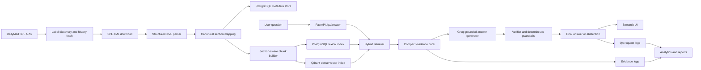

# MedLabelIQ

**MedLabelIQ** is a production-oriented, evidence-grounded medication-label question answering system built on official **DailyMed SPL drug-label data**.

It answers user questions by retrieving relevant sections from structured prescription and OTC drug labels, generating concise answers with **explicit evidence citations**, and abstaining when the retrieved label evidence is insufficient.

The system was designed as a modern replacement for a previous web-scraped medical QA prototype, addressing its core weaknesses:

- poorly organized knowledge sources,
- weak chunking,
- unreliable chatbot answers,
- limited grounding,
- and lack of production observability.

---

## Key Capabilities

- **Official structured knowledge source**
  - Uses DailyMed SPL XML labels rather than loosely scraped web pages.
  - Preserves label metadata, versions, section hierarchy, and source provenance.

- **Section-aware knowledge engineering**
  - Parses nested SPL sections and maps them into retrieval families such as:
    - `warnings_and_precautions`
    - `boxed_warning`
    - `indications_and_usage`
    - `adverse_reactions`
    - `drug_interactions`
    - `clinical_studies`

- **Hybrid retrieval**
  - PostgreSQL lexical retrieval
  - Dense vector retrieval with Qdrant
  - Hybrid Reciprocal Rank Fusion search
  - Compact evidence-pack selection to reduce redundant prompt context

- **Grounded answer generation**
  - Groq-hosted LLM generation
  - Strict JSON answer contract
  - Evidence-ID citations such as `E1`, `E2`
  - Application-controlled safety note

- **Abstention and safety controls**
  - Deterministic `insufficient_evidence` fallback
  - Post-generation evidence verifier
  - Guardrails for:
    - guarantee-style claims,
    - unsupported negative treatment claims inferred by omission

- **Production-oriented application layer**
  - FastAPI backend
  - Streamlit front-end UI
  - Dockerized full stack
  - PostgreSQL request/evidence logging
  - Analytics exports and reporting plots
  - Pytest test suite and GitHub Actions CI

---

## Why This Project Matters

Medication questions are high-stakes. A system that retrieves topically related passages but fabricates unsupported conclusions is not trustworthy.

MedLabelIQ is built around a stricter principle:

> **Only answer when retrieved drug-label evidence directly supports the response. Otherwise, abstain.**

This project demonstrates practical engineering across:

- domain-grounded RAG,
- structured medical knowledge ingestion,
- hybrid search,
- LLM grounding,
- answer verification,
- deterministic safety guardrails,
- API design,
- observability,
- and Dockerized deployment.

---

## System Architecture



---

## End-to-End Pipeline

### 1. Label Ingestion

The ingestion pipeline builds a reproducible smoke-set corpus of 12 representative medication concepts:

- acetaminophen
- ibuprofen
- metformin
- lisinopril
- atorvastatin
- amoxicillin
- sertraline
- albuterol
- omeprazole
- apixaban
- isotretinoin
- methotrexate

The pipeline:

1. discovers label metadata,
2. retrieves version history,
3. downloads SPL XML packages,
4. stores manifests and checksums,
5. validates file consistency.

---

### 2. Structured Parsing

Each SPL XML label is parsed into structured label objects containing:

- product entries,
- section titles,
- LOINC section codes,
- hierarchical section paths,
- canonical section mappings,
- retrieval-family inheritance.

This avoids treating a drug label as a flat raw document and allows retrieval to respect clinical structure.

---

### 3. Chunking

MedLabelIQ builds **section-aware chunks** rather than naive whole-document splits.

Current smoke-set chunking output:

| Metric | Value |
|---|---:|
| Retrievable sections processed | 520 |
| Chunks created | 867 |
| Maximum words per chunk | 220 |
| Chunk overlap | 40 words |

---

### 4. Retrieval

The system supports:

- lexical retrieval,
- dense vector retrieval,
- hybrid retrieval,
- retrieval-family filtering,
- drug-concept filtering.

Example debug command:

```powershell
uv run python -m medlabeliq.retrieval.search_cli `
  --query "acid-mediated GERD" `
  --drug omeprazole `
  --family indications_and_usage `
  --limit 5
```

---

## Evaluation Results

### Lexical Retrieval Evaluation

#### Exact terminology smoke set

| Metric | Score |
|---|---:|
| Cases | 12 |
| Hit@1 | 1.000 |
| Hit@5 | 1.000 |
| MRR | 1.000 |

#### Paraphrase stress test

| Metric | Score |
|---|---:|
| Cases | 12 |
| Hit@1 | 0.333 |
| Hit@5 | 0.333 |
| MRR | 0.333 |

This failure mode motivated the addition of dense and hybrid retrieval.

---

### Grounded QA Evaluation

#### QA smoke set

| Metric | Score |
|---|---:|
| Overall pass | 12/12 |
| Status accuracy | 12/12 |
| Answered-case pass | 8/8 |
| Abstention-case pass | 4/4 |
| Citation-policy pass | 12/12 |
| Cited-heading pass | 12/12 |
| Safety-note pass | 12/12 |

#### QA challenge set

| Metric | Score |
|---|---:|
| Overall pass | 16/16 |
| Status accuracy | 16/16 |
| Answered-case pass | 10/10 |
| Abstention-case pass | 6/6 |
| Citation-policy pass | 16/16 |
| Cited-heading pass | 16/16 |
| Safety-note pass | 16/16 |

The challenge set includes:

- paraphrased answerable questions,
- negative unsupported treatment claims,
- unsupported claims requiring abstention,
- guarantee-style overgeneralization traps,
- medically sensitive warning and contraindication questions.

---

## Grounding and Safety Design

### Deterministic insufficient-evidence response

When the system cannot support an answer from retrieved drug-label evidence, it returns:

```json
{
  "status": "insufficient_evidence",
  "answer": "The retrieved drug-label evidence is not sufficient to answer this question reliably.",
  "citations": [],
  "evidence_summary": "No retrieved evidence directly established the requested claim."
}
```

### Guardrails

MedLabelIQ includes deterministic post-generation controls for failure patterns observed during evaluation.

#### 1. Guarantee-style claim guardrail

Example:

```text
Does metformin guarantee weight loss?
```

The system abstains unless retrieved label evidence explicitly supports guarantee-level certainty.

#### 2. Negative treatment claim guardrail

Example:

```text
Does apixaban treat bacterial infections?
```

The system does **not** infer a negative conclusion merely because label evidence discusses other approved uses. If the target condition is not explicitly addressed, it abstains.

---

## API

The FastAPI backend exposes:

| Method | Endpoint | Purpose |
|---|---|---|
| `GET` | `/` | Service overview |
| `GET` | `/health` | Postgres, Qdrant, and LLM health |
| `POST` | `/qa/answer` | Grounded answer generation |
| `POST` | `/retrieval/debug` | Retrieval-only evidence inspection |

### Example `/qa/answer` request

```powershell
$body = @{
    query = "Can metformin cause dangerous acid buildup in the blood?"
    drug = "metformin"
    family = "warnings_and_precautions"
    include_evidence = $true
    include_diagnostics = $true
} | ConvertTo-Json

Invoke-RestMethod `
    -Method Post `
    -Uri "http://127.0.0.1:8011/qa/answer" `
    -ContentType "application/json" `
    -Body $body | ConvertTo-Json -Depth 20
```

### Example response fields

- final grounded answer,
- answer status,
- citations,
- retrieved evidence,
- verifier verdict,
- guardrail diagnostics,
- request log ID.

---

## Streamlit UI

The front end includes:

- API health panel,
- drug and section-family filters,
- example prompts,
- grounded answer display,
- citations,
- evidence expanders,
- verifier/guardrail diagnostics,
- retrieval-debug tab,
- recent query history.

Local UI:

```text
http://127.0.0.1:8501
```

---

## Observability

Every API QA request can be logged into PostgreSQL using:

- `qa_request_log`
- `qa_evidence_log`

Logged fields include:

- query,
- drug and section filters,
- answer status,
- proposed status,
- citations,
- evidence count,
- verifier verdict,
- guardrail trigger state,
- API latency,
- timestamp.

### Analytics generation

```powershell
uv run python -m medlabeliq.observability.generate_qa_analytics
```

Outputs:

```text
data/interim/qa_analytics/
outputs/qa_analytics/
```

Generated summaries include:

- final answer status counts,
- latency statistics,
- intervention counts,
- verifier verdict distribution,
- evidence-family usage,
- daily request volume,
- CSV exports,
- PNG plots.

---

## Dockerized Deployment

The full stack can be launched with:

```powershell
docker compose up --build -d
```

Services:

| Service | Port |
|---|---:|
| PostgreSQL | `55432` |
| Qdrant | `6333` |
| FastAPI backend | `8011` |
| Streamlit UI | `8501` |

After startup:

```text
API:  http://127.0.0.1:8011
Docs: http://127.0.0.1:8011/docs
UI:   http://127.0.0.1:8501
```

Check service health:

```powershell
Invoke-RestMethod `
    -Method Get `
    -Uri "http://127.0.0.1:8011/health" |
    ConvertTo-Json -Depth 10
```

---

## Local Development Setup

### 1. Clone the repository

```powershell
git clone <YOUR_REPOSITORY_URL>
cd MedLabelIQ
```

### 2. Create environment variables

Copy:

```powershell
Copy-Item .env.example .env
```

Then fill in:

```text
LLM_API_KEY=<your-groq-api-key>
```

### 3. Install dependencies

```powershell
uv sync
```

### 4. Start infrastructure

```powershell
docker compose up -d postgres qdrant
```

### 5. Start the FastAPI backend

```powershell
uv run uvicorn medlabeliq.api.app:app --host 127.0.0.1 --port 8011 --reload
```

### 6. Start the Streamlit UI

```powershell
uv run streamlit run src\medlabeliq\ui\streamlit_app.py --server.port 8501
```

---

## Core Validation Commands

### Validate structured ingestion

```powershell
uv run python -m medlabeliq.validation.validate_step3_artifacts
```

### Parse the smoke-set labels

```powershell
uv run python -m medlabeliq.parsing.parse_smoke_set
```

### Validate section hierarchy

```powershell
uv run python -m medlabeliq.validation.validate_section_hierarchy
```

### Build section-aware chunks

```powershell
uv run python -m medlabeliq.chunking.build_section_chunks
```

### Validate chunking

```powershell
uv run python -m medlabeliq.chunking.validate_section_chunks
```

### Evaluate lexical retrieval

```powershell
uv run python -m medlabeliq.evaluation.evaluate_lexical_retrieval
```

### Evaluate grounded QA smoke set

```powershell
uv run python -m medlabeliq.evaluation.evaluate_grounded_qa
```

### Evaluate grounded QA challenge set

```powershell
uv run python -m medlabeliq.evaluation.evaluate_grounded_qa `
  --eval-set data\evaluation\qa_generation_eval_challenge.yaml `
  --output data\interim\grounded_qa_eval_challenge_results.csv
```

---

## Tests and CI

Run tests locally:

```powershell
uv run pytest
```

Current local test result:

```text
11 passed
```

The repository includes GitHub Actions CI to automatically run tests on pushes and pull requests.

---

## Project Structure

```text
MedLabelIQ/
├── .github/workflows/
│   └── ci.yml
├── data/
│   ├── evaluation/
│   ├── interim/
│   └── raw/
├── outputs/
├── src/medlabeliq/
│   ├── api/
│   ├── chunking/
│   ├── config/
│   ├── db/
│   ├── evaluation/
│   ├── generation/
│   ├── ingestion/
│   ├── observability/
│   ├── parsing/
│   ├── qdrant_store/
│   ├── retrieval/
│   ├── ui/
│   └── validation/
├── tests/
├── Dockerfile
├── docker-compose.yml
├── pyproject.toml
├── uv.lock
└── README.md
```

---

## Technology Stack

- **Language:** Python 3.12
- **Dependency management:** uv
- **API:** FastAPI
- **UI:** Streamlit
- **Structured store:** PostgreSQL
- **Vector store:** Qdrant
- **LLM provider:** Groq
- **Embeddings:** sentence-transformer-based dense retrieval
- **Containers:** Docker, Docker Compose
- **Testing:** pytest
- **CI:** GitHub Actions

---

## Limitations

- The current corpus is a curated 12-drug smoke set, not the complete DailyMed universe.
- The system summarizes drug-label evidence; it is not a medical diagnosis or prescribing tool.
- Evaluation sets are carefully constructed project benchmarks rather than large-scale clinical gold standards.
- Guardrails target observed high-risk QA failure patterns and can be extended further.

---

## Future Work

- Scale the corpus from 12 labels to a larger representative DailyMed collection.
- Add benchmark suites for dosage, contraindications, drug interactions, and pregnancy-specific claims.
- Add richer operational dashboards from observability logs.
- Introduce authentication and rate limiting for production deployment.
- Add continuous ingestion for updated label versions.
- Explore retrieval reranking improvements and larger evidence-sufficiency benchmarks.

---

## Disclaimer

MedLabelIQ is an educational and research-oriented medication-label QA system.  
It summarizes retrieved drug-label evidence and is **not a substitute for medical advice from a qualified clinician or pharmacist**.