# MedLabelIQ — Comprehensive Technical Documentation

## Table of Contents

1. [Project Overview](#1-project-overview)
2. [Problem Motivation](#2-problem-motivation)
3. [Core Design Goals](#3-core-design-goals)
4. [System Capabilities](#4-system-capabilities)
5. [High-Level Architecture](#5-high-level-architecture)
6. [Knowledge Sources](#6-knowledge-sources)
7. [DailyMed SPL Ingestion and Knowledge Engineering](#7-dailymed-spl-ingestion-and-knowledge-engineering)
8. [RxNorm Medication Identity Reasoning](#8-rxnorm-medication-identity-reasoning)
9. [Source-Aware Orchestration](#9-source-aware-orchestration)
10. [Mixed-Source Query Decomposition and Synthesis](#10-mixed-source-query-decomposition-and-synthesis)
11. [Hybrid Retrieval Architecture](#11-hybrid-retrieval-architecture)
12. [Grounded Answer Generation, Verification, and Guardrails](#12-grounded-answer-generation-verification-and-guardrails)
13. [User Interface Walkthrough](#13-user-interface-walkthrough)
14. [API Demonstrations](#14-api-demonstrations)
15. [Evaluation and Validation](#15-evaluation-and-validation)
16. [Observability and Analytics](#16-observability-and-analytics)
17. [How to Run the System](#17-how-to-run-the-system)
18. [Project Strengths](#18-project-strengths)
19. [Current Limitations](#19-current-limitations)
20. [Future Work](#20-future-work)
21. [Project Assets Index](#21-project-assets-index)
22. [Final Takeaway](#22-final-takeaway)

---

# 1. Project Overview

**MedLabelIQ** is a production-oriented, evidence-grounded medication question-answering platform that combines:

- official **DailyMed SPL drug-label evidence**,
- **RxNorm medication identity reasoning**,
- **source-aware orchestration**,
- **mixed-source query decomposition and grounded synthesis**,
- **hybrid retrieval**,
- **LLM-based grounded answer generation**,
- **verification and abstention safeguards**,
- and **observability analytics**.

The system is designed around a strict principle:

> **Only answer when the selected knowledge source directly supports the response. Otherwise, abstain.**

MedLabelIQ supports three major categories of medication questions:

1. **Identity questions**
   - “Is Eliquis the same as apixaban?”
   - “What is the generic name of Glucophage?”

2. **Clinical label questions**
   - “Can apixaban be taken with aspirin?”
   - “What is omeprazole used for?”

3. **Mixed-source compound questions**
   - “Is Eliquis the same as apixaban and can it prevent stroke?”

The final system includes a FastAPI backend, Streamlit front end, PostgreSQL, Qdrant, Dockerized deployment, structured observability, and rigorous evaluation benchmarks. It passed:

- **64 automated tests**
- **11/11 multi-source orchestration smoke benchmark cases**
- **19/19 multi-source challenge benchmark cases**

---

# 2. Problem Motivation

Medication question answering is a high-stakes domain. A typical chatbot-style medical QA system can fail in several ways:

- retrieving topically related text but generating unsupported conclusions,
- mixing brand names and generic names incorrectly,
- treating medication identity questions and clinical label questions as the same task,
- failing to distinguish between “the label does not mention this” and “the label proves this is false,”
- returning overconfident answers without evidence provenance,
- lacking production analytics to inspect failures.

MedLabelIQ was built to address these issues through a **source-aware grounded architecture** rather than a single generic RAG pipeline.

The project replaces the earlier medical QA prototype approach with a more robust system built around:

- official structured medication labels,
- biomedical terminology normalization,
- explicit source routing,
- branch-specific reasoning,
- deterministic abstention,
- and proof-backed evaluation.

---

# 3. Core Design Goals

MedLabelIQ was designed with six main goals.

## 3.1 Grounded Medication QA

Every clinical answer must be traceable to retrieved label evidence.

## 3.2 Separate Identity Reasoning from Clinical Reasoning

Medication identity questions should use structured RxNorm reasoning, not LLM inference over loosely retrieved label text.

## 3.3 Support Compound Multi-Source Questions

If a query contains both identity and clinical intent, the system should decompose it and answer each branch using the correct evidence source.

## 3.4 Abstain Safely

If evidence is insufficient, return a deterministic `insufficient_evidence` answer instead of forcing a response.

## 3.5 Expose Internal Reasoning for Debugging

The UI and API should expose source routing, planned retrieval families, mixed-source decomposition, evidence channels, and verification status.

## 3.6 Operate Like a Production System

The project should include:

- API layer,
- UI layer,
- persistence,
- vector database,
- test suite,
- evaluation harnesses,
- structured logging,
- analytics exports,
- and Docker support.

---

# 4. System Capabilities

## 4.1 RxNorm Identity QA

Examples:

```text
Is Eliquis the same as apixaban?
What is the generic name of Glucophage?
Is Glucophage a brand name?
What is the active ingredient of Eliquis?
```

The system:

- detects identity intent,
- resolves medication terms through RxNorm,
- traverses ingredient and brand relationships,
- answers deterministically,
- cites structured RxNorm identity evidence as `R1`, `R2`, etc.

---

## 4.2 DailyMed Clinical Label QA

Examples:

```text
Can apixaban be taken with aspirin?
What is omeprazole used for?
Can metformin cause lactic acidosis?
Does apixaban treat bacterial infections?
```

The system:

- detects drug mentions,
- resolves brands/generics where needed,
- plans the likely section family,
- retrieves label sections through hybrid search,
- builds a compact evidence pack,
- generates a grounded answer,
- verifies the answer,
- cites DailyMed evidence as `E1`, `E2`, etc.

---

## 4.3 Mixed-Source Composed QA

Examples:

```text
Is Eliquis the same as apixaban and can it prevent stroke?
Is Glucophage the same as metformin and what is it used for?
Is Glucophage a brand name and what is it used for?
```

The system:

- identifies a mixed identity + clinical query,
- decomposes it into subqueries,
- routes one subquery to RxNorm,
- routes the other to DailyMed retrieval + generation,
- combines the results into one grounded answer,
- preserves both evidence channels:
  - `R*` for RxNorm
  - `E*` for DailyMed

---

# 5. High-Level Architecture

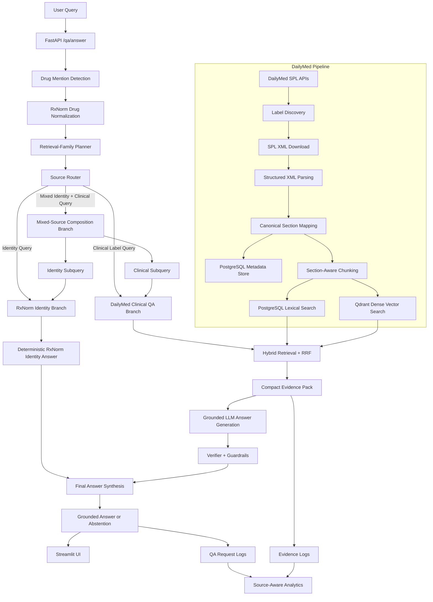

---

# 6. Knowledge Sources

MedLabelIQ uses two primary knowledge sources.

| Source | Purpose |
|---|---|
| **DailyMed SPL labels** | Clinical drug-label evidence |
| **RxNorm** | Medication identity, brand/generic relationships, ingredient mappings |

---

## 6.1 DailyMed SPL

DailyMed provides official FDA-submitted labeling content in structured SPL XML form.

MedLabelIQ uses DailyMed to answer clinical questions involving:

- indications and usage,
- drug interactions,
- boxed warnings,
- warnings and precautions,
- contraindications,
- adverse reactions,
- dosage,
- clinical studies,
- medication guides,
- patient counseling information.

---

## 6.2 RxNorm

RxNorm is used for identity and normalization tasks such as:

- brand-to-generic lookup,
- generic-to-brand lookup,
- active ingredient reasoning,
- brand/generic equivalence,
- mapping brand names to indexed corpus concepts.

Examples:

```text
Glucophage → metformin
Eliquis → apixaban
```

---

# 7. DailyMed SPL Ingestion and Knowledge Engineering

The DailyMed ingestion pipeline creates a structured, reproducible medication corpus.

## 7.1 Smoke Corpus

The current corpus contains 12 representative medication concepts:

- acetaminophen
- ibuprofen
- metformin
- lisinopril
- atorvastatin
- amoxicillin
- sertraline
- albuterol
- omeprazole
- apixaban
- isotretinoin
- methotrexate

---

## 7.2 Ingestion Flow

```text
DailyMed Label Discovery
→ Label Version History
→ SPL XML Download
→ Metadata and Checksum Recording
→ XML Parsing
→ Section Hierarchy Reconstruction
→ Canonical Section Mapping
→ Chunk Generation
→ Lexical and Dense Indexing
```

---

## 7.3 Section-Aware Knowledge Representation

Nested label sections are preserved and mapped into retrieval families.

Examples of canonical families:

- `warnings_and_precautions`
- `boxed_warning`
- `indications_and_usage`
- `adverse_reactions`
- `drug_interactions`
- `dosage_and_administration`
- `contraindications`
- `clinical_studies`
- `medication_guide`

This allows the system to retrieve semantically relevant evidence while respecting the clinical organization of official labels.

---

## 7.4 Corpus Snapshot

| Metric | Value |
|---|---:|
| Drugs | 12 |
| Sections | 663 |
| Chunks | 867 |
| Qdrant points | 867 |

---

# 8. RxNorm Medication Identity Reasoning

MedLabelIQ uses RxNorm to handle identity-style medication questions deterministically.

## 8.1 Example Identity Query

```text
Is Eliquis the same as apixaban?
```

The system resolves:

- `Eliquis` as a brand concept,
- `apixaban` as the related ingredient concept.

It then returns:

```text
Yes. RxNorm maps Eliquis and apixaban to the same ingredient concept: apixaban.
```

with citations:

```text
R1, R2
```

---

## 8.2 Why This Matters

Identity reasoning should not depend on LLM inference over retrieved text. By isolating it into a structured branch:

- equivalence logic is more deterministic,
- brand/generic questions are handled transparently,
- clinical retrieval is reserved for actual label questions,
- mixed-source composition becomes possible.

---

# 9. Source-Aware Orchestration

Every incoming query passes through a deterministic orchestration layer.

## 9.1 Orchestration Stages

```text
1. Query intake
2. Drug mention detection
3. Optional RxNorm normalization
4. Retrieval-family planning
5. Source-route planning
6. Branch execution
7. Grounded response construction
```

---

## 9.2 Source Router

The router selects one of three answer paths:

```text
rxnorm_identity
dailymed_label
multi_source_composed
```

### Example routes

| Query | Route |
|---|---|
| Is Eliquis the same as apixaban? | `rxnorm_identity` |
| Can apixaban be taken with aspirin? | `dailymed_label` |
| Is Eliquis the same as apixaban and can it prevent stroke? | `multi_source_composed` |

---

## 9.3 Retrieval-Family Planner

Clinical questions are mapped to likely label families.

Examples:

| Query | Planned Family |
|---|---|
| What is omeprazole used for? | `indications_and_usage` |
| Can apixaban be taken with aspirin? | `drug_interactions` |
| Can metformin cause lactic acidosis? | candidate safety family group |

This reduces irrelevant evidence and improves retrieval grounding.

---

# 10. Mixed-Source Query Decomposition and Synthesis

Mixed-source composition is one of the most distinctive parts of MedLabelIQ.

## 10.1 Example Mixed Query

```text
Is Eliquis the same as apixaban and can it prevent stroke?
```

The system identifies:

- an identity clause:
  ```text
  Is Eliquis the same as apixaban?
  ```
- a clinical clause:
  ```text
  Can apixaban prevent stroke?
  ```

---

## 10.2 Branch Execution

### Identity Branch

Uses RxNorm:

```text
Eliquis → apixaban ingredient equivalence
```

### Clinical Branch

Uses DailyMed:

```text
Apixaban indication evidence related to stroke-risk reduction
```

---

## 10.3 Final Composed Answer

The final response preserves both evidence channels:

```text
Yes. RxNorm maps Eliquis and apixaban to the same ingredient concept: apixaban.
Yes. Apixaban is indicated to reduce the risk of stroke and systemic embolism in
patients with nonvalvular atrial fibrillation.
```

Citations:

```text
R1, R2, E1
```

---

## 10.4 Safety Rule for Mixed Composition

The system composes an answer only when both branches are sufficiently supported.

If either branch is insufficient:

```text
Identity unsupported
OR
Clinical unsupported
```

then the final answer becomes:

```text
insufficient_evidence
```

rather than a partial or misleading synthesis.

---

# 11. Hybrid Retrieval Architecture

The DailyMed branch uses a hybrid retrieval strategy.

## 11.1 Retrieval Components

- PostgreSQL lexical retrieval
- Qdrant dense vector retrieval
- Reciprocal Rank Fusion
- drug-concept filtering
- retrieval-family filtering
- compact evidence-pack construction

---

## 11.2 Why Hybrid Retrieval?

Pure keyword retrieval may fail on paraphrases. Dense retrieval may surface semantically related but less precise content. Hybrid retrieval balances both.

The system initially showed strong exact-match retrieval but weaker paraphrase robustness, motivating dense retrieval and RRF-based fusion.

---

# 12. Grounded Answer Generation, Verification, and Guardrails

## 12.1 Grounded Answer Schema

Every final answer contains:

- `status`
- `answer`
- `citations`
- `evidence_summary`
- `safety_note`

---

## 12.2 Answer Status

Two statuses are supported:

```text
answered
insufficient_evidence
```

---

## 12.3 Deterministic Abstention

When evidence is insufficient, MedLabelIQ returns a deterministic safe response instead of hallucinating.

Example:

```json
{
  "status": "insufficient_evidence",
  "answer": "The retrieved drug-label evidence is not sufficient to answer this question reliably.",
  "citations": [],
  "evidence_summary": "No retrieved evidence directly established the requested claim."
}
```

---

## 12.4 Verifier

The verifier checks whether the proposed response is supported by retrieved evidence.

It can produce judgments such as:

```text
supported
insufficient
refuted
```

---

## 12.5 Guardrails

Implemented guardrail themes include:

- unsupported certainty claims,
- overgeneralized treatment claims,
- unsupported negative claims,
- insufficient-evidence routing for weak branch support.

---

# 13. User Interface Walkthrough

The Streamlit UI exposes not only final answers, but also the internal evidence flow.

---

## 13.1 Home Screen

The landing page shows:

- project identity,
- knowledge-source summary,
- orchestration summary,
- safety-layer summary,
- example prompts,
- backend health,
- corpus snapshot,
- retrieval filters.

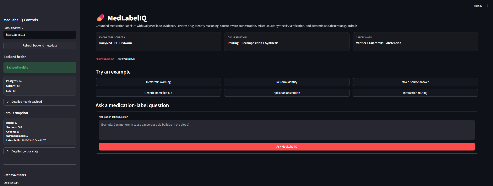

---

## 13.2 RxNorm Identity Answer

Query:

```text
Is Eliquis the same as apixaban?
```

The UI displays:

- answered status,
- RxNorm Identity source badge,
- final identity answer,
- `R1`, `R2` citations,
- source-specific safety note.

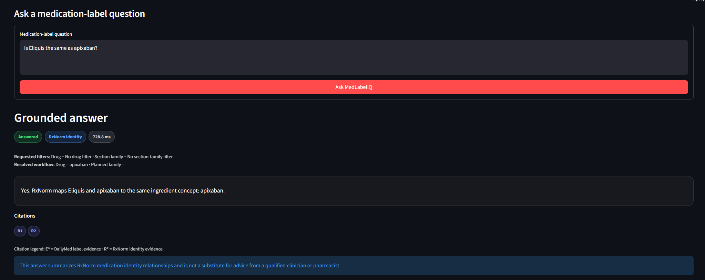

---

## 13.3 RxNorm Identity Evidence

The identity evidence panel shows:

- resolved concept,
- RxCUI,
- related ingredient,
- related brand,
- evidence summary.

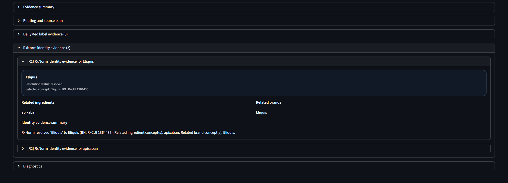

---

## 13.4 DailyMed Clinical Answer

Query:

```text
Can apixaban be taken with aspirin?
```

The UI displays:

- answered status,
- DailyMed Label source badge,
- verifier-supported status,
- final answer discussing bleeding risk,
- `E1` citation.

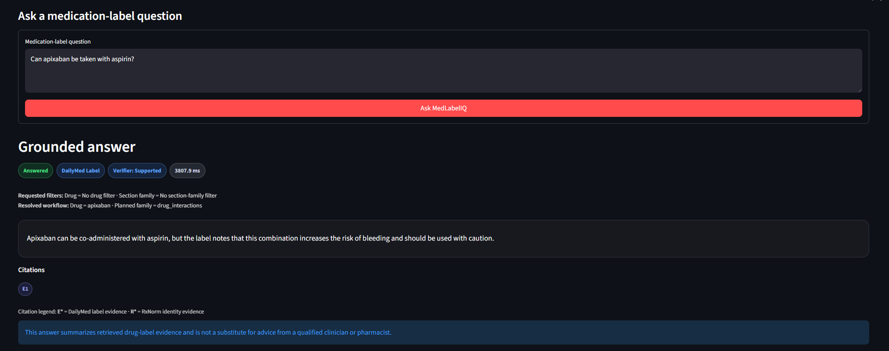

---

## 13.5 DailyMed Label Evidence

The evidence panel exposes:

- exact label section,
- source label metadata,
- hybrid retrieval score,
- lexical and dense rank,
- retrieved evidence text.

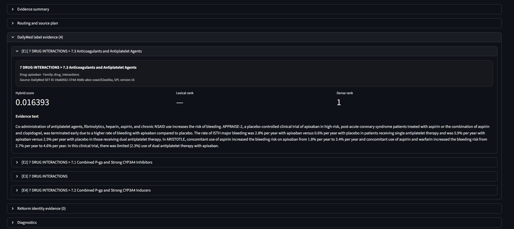

---

## 13.6 Mixed-Source Composed Answer

Query:

```text
Is Eliquis the same as apixaban and can it prevent stroke?
```

The UI displays:

- answered status,
- Multi-Source Composed badge,
- verifier-supported badge,
- citation set `R1`, `R2`, `E1`,
- mixed-source safety note.

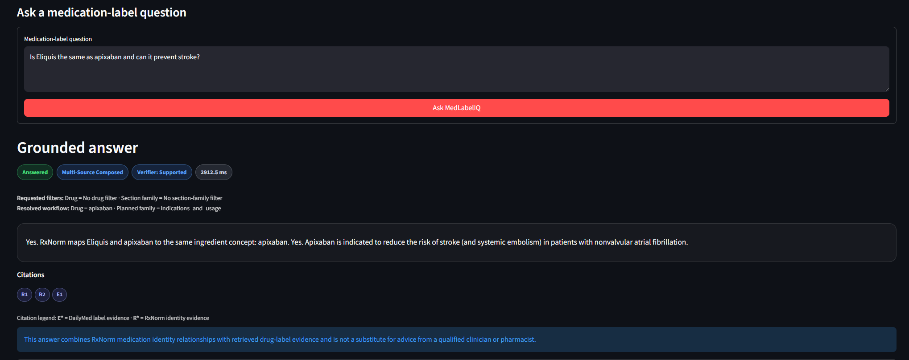

---

## 13.7 Mixed-Source Decomposition and Routing

The routing panel reveals:

- planned source,
- resolved drug,
- planned family,
- source status,
- family-plan status,
- composition status,
- identity subquery,
- clinical subquery.

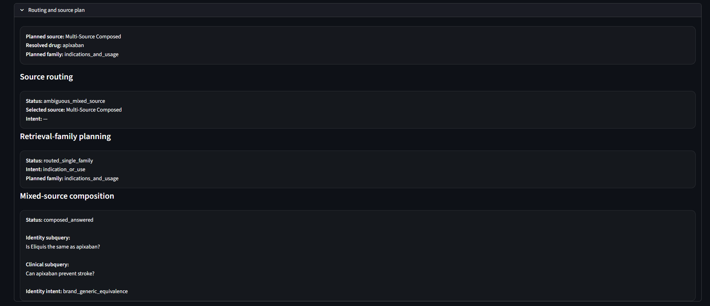

---

## 13.8 Mixed-Source Dual Evidence Channels

The UI clearly separates:

- DailyMed clinical evidence,
- RxNorm identity evidence.

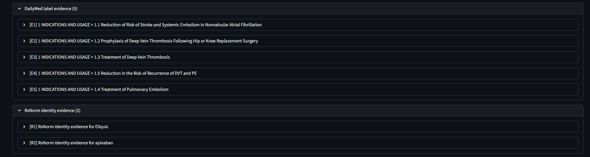

---

# 14. API Demonstrations

Saved raw API responses are available under:

```text
docs/demo_assets/api/
```

---

## 14.1 RxNorm Identity API Response

Artifact:

```text
docs/demo_assets/api/01_rxnorm_identity_response.json
```

Demonstrates:

- `planned_source = rxnorm_identity`
- `result.status = answered`
- `citations = R1, R2`
- RxNorm identity evidence payload

---

## 14.2 DailyMed Clinical API Response

Artifact:

```text
docs/demo_assets/api/02_dailymed_clinical_response.json
```

Demonstrates:

- `planned_source = dailymed_label`
- retrieved label evidence
- verifier-supported grounded answer
- `E1` citation

---

## 14.3 Mixed-Source Composed API Response

Artifact:

```text
docs/demo_assets/api/03_mixed_source_composed_response.json
```

Demonstrates:

- `planned_source = multi_source_composed`
- mixed-source composition metadata
- identity and clinical subqueries
- combined `R* + E*` citations
- parallel evidence channels in one response

---

# 15. Evaluation and Validation

MedLabelIQ includes both unit tests and behavior-level evaluation harnesses.

---

## 15.1 Automated Test Suite

Artifact:

```text
docs/demo_assets/evaluation/01_pytest_64_passed.txt
```

Final result:

```text
64 passed
```

---

## 15.2 Multi-Source Orchestration Smoke Benchmark

Artifact:

```text
docs/demo_assets/evaluation/03_multisource_smoke_11_of_11.txt
```

Final benchmark:

| Metric | Result |
|---|---:|
| Overall pass | 11/11 |
| Status accuracy | 11/11 |
| Source-route accuracy | 11/11 |
| Source-route-status accuracy | 11/11 |
| Citation-policy pass | 11/11 |
| Citation-reference pass | 11/11 |

---

## 15.3 Multi-Source Challenge Benchmark

Artifact:

```text
docs/demo_assets/evaluation/02_multisource_challenge_19_of_19.txt
```

Final benchmark:

| Metric | Result |
|---|---:|
| Overall pass | 19/19 |
| Status accuracy | 19/19 |
| Source-route accuracy | 19/19 |
| Source-route-status accuracy | 19/19 |
| Family-plan-status accuracy | 19/19 |
| Retrieval-family accuracy | 9/9 |
| Citation-policy pass | 19/19 |
| Citation-reference pass | 19/19 |
| Safety-note pass | 19/19 |

---

## 15.4 Benchmark Coverage

The challenge benchmark tests:

- brand/generic equivalence,
- active ingredient lookup,
- negative identity claims,
- unsupported identity claims,
- brand-name clinical questions,
- clinical abstention cases,
- mixed-source query decomposition,
- composed mixed-source answers,
- citation integrity,
- source routing correctness,
- retrieval-family planning correctness.

---

# 16. Observability and Analytics

MedLabelIQ logs each QA request and evidence trace into PostgreSQL.

## 16.1 Request-Level Observability

Captured fields include:

- query,
- requested drug,
- resolved drug,
- drug mention detection status,
- family plan status,
- source route,
- mixed-source composition status,
- final answer status,
- verifier verdict,
- guardrail status,
- DailyMed evidence count,
- RxNorm identity evidence count,
- latency.

---

## 16.2 Analytics Report Artifact

```text
docs/demo_assets/analytics/05_qa_analytics_terminal_report.txt
```

This report summarizes:

- final answer statuses,
- source-route distribution,
- family-plan distribution,
- composition statuses,
- latency breakdown,
- evidence-family usage.

---

## 16.3 Requests by Planned Source

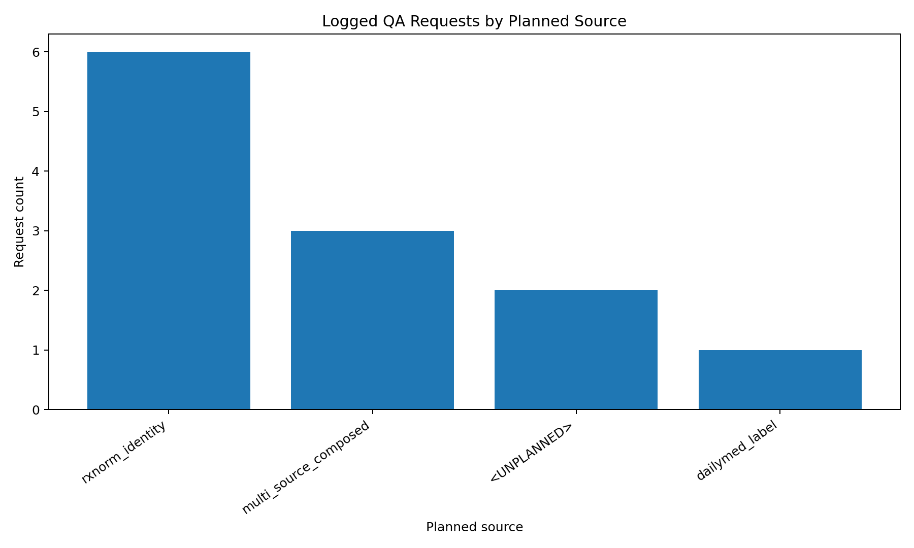

This plot shows how logged QA traffic is distributed across:

- RxNorm identity,
- DailyMed label,
- multi-source composed routes.

---

## 16.4 Mean Latency by Planned Source

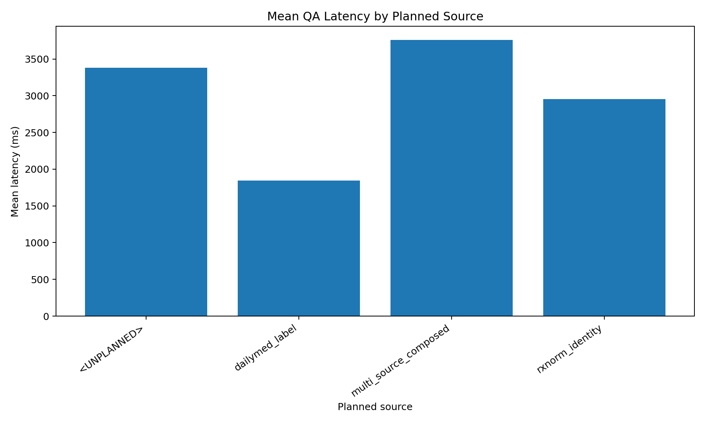

This plot compares response latency across route types.

---

## 16.5 Mixed-Source Composition Status Counts

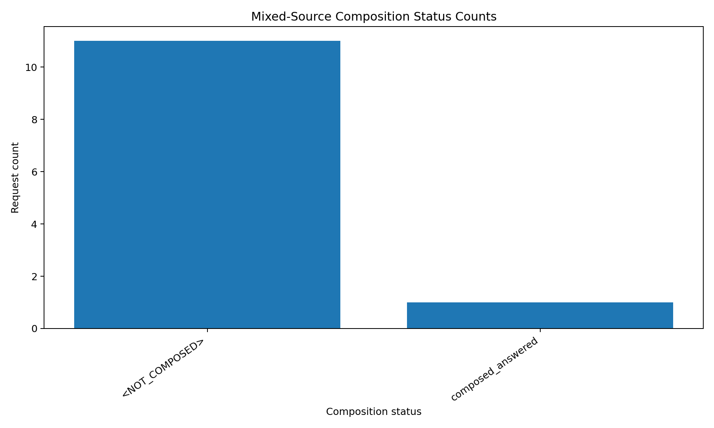

This plot tracks whether mixed-source requests were composed successfully.

---

## 16.6 Total Support Evidence Count Distribution

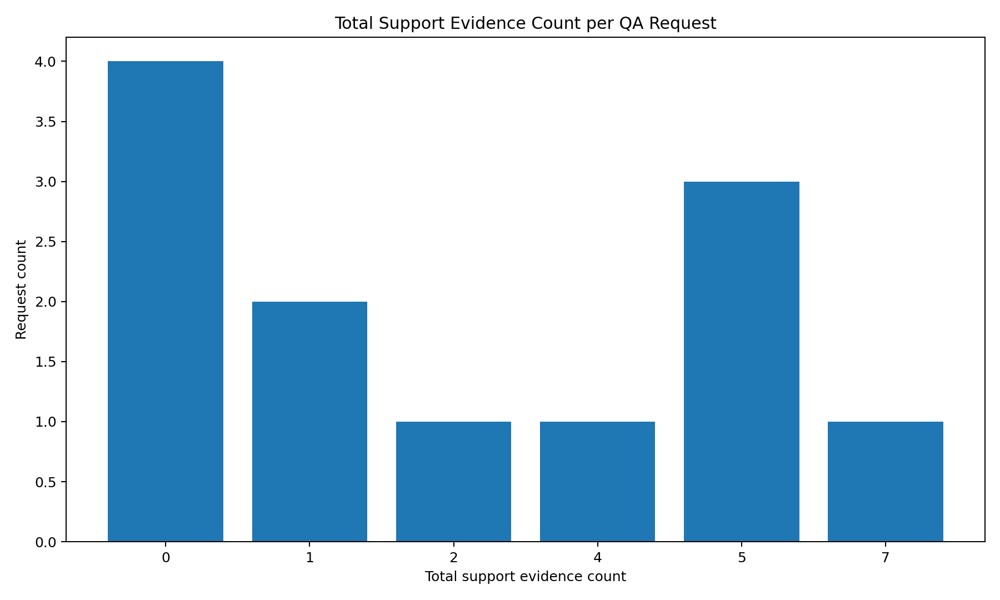

This plot summarizes the evidence footprint used to support answers.

---

# 17. How to Run the System

## 17.1 Recommended Full-Stack Docker Run

From the project root:

```powershell
docker compose up --build -d
```

Check running services:

```powershell
docker compose ps
```

Expected services:

```text
medlabeliq-postgres
medlabeliq-qdrant
medlabeliq-api
medlabeliq-ui
```

Open:

```text
UI:   http://127.0.0.1:8501
API:  http://127.0.0.1:8011
Docs: http://127.0.0.1:8011/docs
```

---

## 17.2 Health Check

```powershell
Invoke-RestMethod `
    -Method Get `
    -Uri "http://127.0.0.1:8011/health" |
    ConvertTo-Json -Depth 20
```

Expected:

```text
status: ok
postgres: ok
qdrant: ok
llm: ok
```

---

## 17.3 Local Development Run

### Start infrastructure

```powershell
docker compose up -d postgres qdrant
```

### Start backend

```powershell
.venv\Scripts\activate
uv run uvicorn medlabeliq.api.app:app --host 127.0.0.1 --port 8011 --reload
```

### Start UI

```powershell
.venv\Scripts\activate
uv run streamlit run src\medlabeliq\ui\streamlit_app.py --server.port 8501
```

---

# 18. Project Strengths

MedLabelIQ stands out because it combines several advanced applied AI engineering ideas in one coherent system:

## 18.1 More Than a Standard RAG Chatbot

It separates:
- structured identity reasoning,
- grounded clinical QA,
- mixed-source composed reasoning.

## 18.2 Official Domain-Specific Knowledge

It uses:
- DailyMed SPL labels,
- RxNorm identity metadata.

## 18.3 Agentic Orchestration Without Overcomplication

The workflow includes:
- intent routing,
- family planning,
- source selection,
- branch execution,
- decomposition,
- synthesis.

## 18.4 Strong Grounding Discipline

It enforces:
- evidence citations,
- verifier support,
- deterministic abstention,
- conservative mixed-branch safety.

## 18.5 Production-Oriented Engineering

It includes:
- FastAPI,
- Streamlit,
- PostgreSQL,
- Qdrant,
- Docker,
- tests,
- benchmark suites,
- analytics exports.

---

# 19. Current Limitations

The system is intentionally scoped and honest about its limits.

- The DailyMed corpus is currently a curated 12-drug smoke set.
- Mixed-source decomposition focuses on structured conjunction-style identity + clinical questions.
- The benchmark sets are project-level evaluation suites, not clinician-authored medical gold standards.
- The system is not a prescribing tool or clinical decision support system.
- The evidence sufficiency logic can be extended further for broader clinical coverage.

---

# 20. Future Work

Potential next steps include:

- scale from 12 drugs to a broader DailyMed corpus,
- add larger medically curated evaluation sets,
- broaden mixed-source decomposition patterns,
- support more general multi-branch planning,
- improve retrieval sufficiency scoring,
- add reranking,
- deploy to a cloud environment,
- add authentication and rate limiting,
- add live operational dashboards,
- support continuous DailyMed label refresh pipelines.

---

# 21. Project Assets Index

## UI Screenshots

```text
docs/demo_assets/ui/01_medlabeliq_home.png
docs/demo_assets/ui/02_rxnorm_identity_answer.png
docs/demo_assets/ui/03_rxnorm_identity_evidence.png
docs/demo_assets/ui/04_dailymed_clinical_answer.png
docs/demo_assets/ui/05_dailymed_label_evidence.png
docs/demo_assets/ui/06_mixed_source_composed_answer.png
docs/demo_assets/ui/07_mixed_source_decomposition.png
docs/demo_assets/ui/08_mixed_source_dual_evidence.png
```

---

## API JSON Responses

```text
docs/demo_assets/api/01_rxnorm_identity_response.json
docs/demo_assets/api/02_dailymed_clinical_response.json
docs/demo_assets/api/03_mixed_source_composed_response.json
```

---

## Evaluation Proof

```text
docs/demo_assets/evaluation/01_pytest_64_passed.txt
docs/demo_assets/evaluation/02_multisource_challenge_19_of_19.txt
docs/demo_assets/evaluation/03_multisource_smoke_11_of_11.txt
```

---

## Analytics Proof

```text
docs/demo_assets/analytics/01_requests_by_planned_source.png
docs/demo_assets/analytics/02_mean_latency_by_planned_source.png
docs/demo_assets/analytics/03_mixed_source_composition_status_counts.png
docs/demo_assets/analytics/04_total_support_evidence_count_distribution.png
docs/demo_assets/analytics/05_qa_analytics_terminal_report.txt
```

---

# 22. Final Takeaway

MedLabelIQ demonstrates how a medical QA system can move beyond a generic chatbot architecture into a **grounded, multi-source, safety-aware applied AI platform**.

Its core contribution is not simply that it retrieves drug information, but that it:

- knows **which knowledge source** should answer,
- preserves **evidence provenance**,
- decomposes **compound questions**,
- synthesizes **citation-preserving answers**,
- and abstains when a trustworthy answer cannot be constructed.

The final system represents a complete applied AI engineering workflow spanning:

- data ingestion,
- structured knowledge modeling,
- retrieval,
- orchestration,
- LLM grounding,
- verification,
- observability,
- UI design,
- evaluation,
- and deployment readiness.